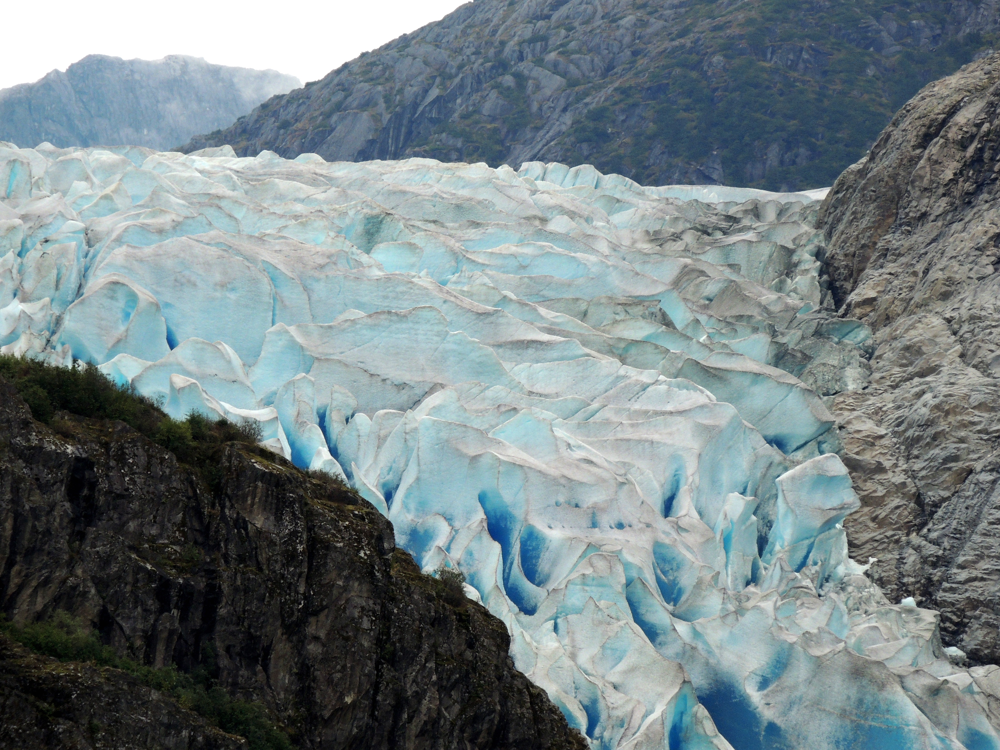

Hello Reader,

My name is Matthew Groves, I am a science teacher and former pastor with academic backgrounds in both religion and physics. Professionally, I work to increase scientific literacy among Christians and to foster dialogue between the scientific and faith-based communities. Recently, I have received enough questions about climate change that I decided to write a guide to the topic. Although I do include some summary, this mostly acts as an annotated map to the primary literature, so that you can find what you might be looking for. In recognizing that this is an absurd amount of material to cover, I’ve **bolded** what I believe will be the most helpful or important. If you just want the overview, I recommend the Introduction, looking over images or anything **bolded** in the body, the Conclusion, and clicking around [NASA’s site on climate change](http://climate.nasa.gov/).

If you don’t believe in climate change, this is not intended to “convert” you. But I hope it will show you the sheer bulk of evidence that has convinced 99.99% of scientists who work in the field (see the section titled “The Scientific Consensus” below).

Climate change is a scientific issue, and a policy issue, but in my mind it is foremost a humanitarian and moral issue. The world’s wealthiest people predominantly caused this problem, but the world’s poorest people will predominantly suffer its effects. For a more detailed analysis of climate change and theology, I wrote an op-ed called [“Climate Change is a Gospel issue.”](https://baptistnews.com/article/climate-change-gospel-issue-time-christians-acknowledged/)

While researching, I have – by both choice and necessity – spent considerable time wandering around corners of the internet that deny the existence of climate change. This depresses me because I believe these perspectives are, intentionally or not, hurting the standard of living of my future children and grandchildren. As a good rule of thumb, I would encourage you to always double-check the sources that individuals use. Specifically, ensure that the source references articles from peer-reviewed journals, which means the content has been analyzed by professionals in the field. There are rigorous systems in place to ensure that peer-reviewed articles are credible, and it’s a big deal to get published. It requires infinitely more credibility than simply making a blog post. If you are ever not sure if something is credible, feel free to send it to me and I’ll check it out for you. In the Age of the Internet, it can be easier than ever for less-credible voices to get attention.

Here’s a general outline that you can use as a table of contents, followed by my take on each topic. I’ve tried to include my references wherever possible so that you can read for yourself, and there are a lot of hyperlinks for easy clicking. The links are also listed at the end of the document. Feel free to email me about climate change or other science issues. I will do my best to answer your questions or steer you towards resources that can. Happy reading.

Matthew Groves

Text last revised Spring 2017

[matthew@matthewdgroves.com](matthew@matthewdgroves.com)

Vanderbilt Divinity School – MDiv. 2019
The College of William & Mary – B.S. 2016: Physics, Religious Studies

## TABLE OF CONTENTS
(Click a topic to jump ahead if you like)

* ##### Introduction
    * Attitude and approach
    * XKCD Timeline
    * Changing Temperatures since 1850
* ##### Data and the Science
    * NASA
    * The IPCC (Inter-governmental Panel on Climate Change)
        * FAQs
        * Certainties
        * How we know the warming is caused by humans and not natural processes
    * Extra thought: What’s the difference in climate and weather? How can we predict the climate but not Saturday’s temperature?
* ##### The Scientific Consensus
    * Human-caused climate change is “virtually unanimous”
    * The “97%” statistic (Cook 2013) and its proper usage
        * A common critique of the Cook 2013 article
* ##### The Public Consensus
    * The “Consensus Gap” and why it bothers me
    * How it is slowly improving
* ##### The Carbon Cycle and Greenhouse Gases
    * A superb (if colorful) article about the history of humanity and fossil fuels
    * Extra thought: Isn’t all of this worrying over just a few degrees? Why such a fuss over such a little shift?
* ##### COP 21: The Paris Agreement
    * The basics
* ##### Conclusion
    * Denial is a problem for both conservatives and liberals
    * Theology
* ##### Links referenced

# Intro

To begin, a comment I hear a lot is “It’s arrogant to believe we can change something as large as the climate.” By a charitable reading, this has a nice dose of humility. Unfortunately, it is ultimately an opinion brought to a discussion about facts. A decent metaphor is to say that “It’s arrogant to believe we could destroy the entire Amazon forest” without checking whether or not we’re cutting down trees, and how quickly. In short, I would argue that it’s more arrogant to assume that humanity can do whatever it wants without any consequences.

Two things first, to get your feet wet. The [graph below](https://xkcd.com/1732/) is an accurate, humorous overview to get a feel for the timescale of climate change. The creator, XKCD.com, is a science humor website run by a former NASA employee named Randall Munroe. He got his data from the IPCC, which I’ll discuss below. Quality charts are worth a thousand words, and this is one of the best plots in all of science communication.  It demonstrates that the climate does indeed go through warming cycles, but not with anything approaching the severity of our warming in the last 150 years. I would encourage you to think of a person who lived “a very long time ago” (Jesus, for example) and keep that date in mind as you scroll through:

Second, the graphic below, from [this page](http://www.climate-lab-book.ac.uk/2016/spiralling-global-temperatures/), is an excellent visualization of temperature change over the last century and a half. The author, Dr. Ed Hawkins, is a Meteorologist at the University of Reading in the UK. He also references climate data from the 5th Edition IPCC report, to which he contributed.

# Data and the Science

NASA is heavily involved in climate research (we usually forget about the “Air” in National Aeronautics and Space Administration). NASA has [an entire website](http://climate.nasa.gov/scientific-consensus/) devoted to climate change, which houses huge amounts of resources. I’ve pulled three charts directly from the site here and made a small list of other recommendations below them. I encourage you to click around the “Evidence” and “Consensus” sections on the site and anything else that looks interesting.

**Temperature**: “[This graph](http://climate.nasa.gov/) illustrates the change in global surface temperature relative to 1951-1980 average temperatures. The 10 warmest years in the 136-year record all have occurred since 2000, with the exception of 1998. The year 2015 ranks as the warmest on record.”

[Carbon Dioxide (CO2) levels in the atmosphere](http://climate.nasa.gov/evidence/): 

The climate does indeed go through cycles, as is often noted by climate change skeptics. But not like this, as the figure above shows. For more information about why CO2 and other greenhouse gas levels in the atmosphere matter, look ahead to the section called “The Carbon Cycle and Greenhouse Gases.”

An [update from the 2013 IPCC report](http://climate.nasa.gov/climate_resources/26/), to which 25 NASA scientists contributed:

* An [infographic on sea level rise](http://climate.nasa.gov/climate_resources/125/)
* A [time-lapse of global temperatures since 1888](http://climate.nasa.gov/climate_resources/139/) 
    * (Or [the same time-lapse with a cool slider](http://climate.nasa.gov/vital-signs/global-temperature/)
* A great [interactive page about changing ice levels around the world](http://climate.nasa.gov/interactives/global-ice-viewer/#/)

The IPCC is the Inter-governmental Panel on Climate Change, set up in the late 1980s by the United Nations (UN) to analyze the technical literature and provide recommendations for policy makers across the world. It’s perhaps the biggest name in the field, made up of thousands of the most-qualified experts from across the globe; their reports are published by Cambridge University Press. The IPCC has a massive (~1000 page massive) [report](http://www.ipcc.ch/pdf/assessment-report/ar4/wg1/ar4_wg1_full_report.pdf) (4th Edition published in 2007, 5th Edition published in 2013) that is the global reference book for the topic. It’s too big to work with here, and too unwieldy to be of much use to anyone without a scientific background. Instead, I’m going to reference a few of its segments, linked below, and use my words as a guide to the primary literature. Narrative summaries are great, but there’s simply too much content for me to write a quality summary of everything (anyway, there are already textbooks on climate change, and I want this to be accessible.) This way, it will be easier for you to use this document as a bridge to the world-class literature itself. I felt the 4th edition had a more introductory, accessible list of FAQs addressed, so I focus more on it here. I attached a [poster](http://www.ipcc.ch/report/ar5/wg1/docs/WGI_AR5_2013_Poster.pdf) from the 5th edition below, which includes a few of the most important figures. The 5th edition does not overturn or significantly disagree with the conclusions of the 4th edition.

The two segments I’ll be addressing here are the 2007 IPCC Report’s [FAQ](https://www.ipcc.ch/pdf/assessment-report/ar4/wg1/ar4-wg1-faqs.pdf) and [Technical Summary](https://www.ipcc.ch/pdf/assessment-report/ar4/wg1/ar4-wg1-ts.pdf). Each question in the FAQ segment has a helpful one-page write-up, with the pertinent data and usually a diagram. I’ve listed the questions below for you to browse. Also, see pages 22-23 of the Technical Summary for a list of how the IPCC defines their confidence terms (“very likely” means >90% probability, etc.).

* What Factors Determine Earth’s Climate?
* **What is the Relationship between Climate Change and Weather?**
* What is the Greenhouse effect?
* How do Human Activities Contribute to Climate Change and How do they compare with Natural Influences?
* **How are Temperatures on Earth Changing? (A great chart shows temperatures both in absolute (right vertical axis) and compared to recent averages (left vertical axis). Note the increasing steepness of the rates of change as the timescale becomes more recent.)**
* How is precipitation changing?
* Has there been a change in extreme events like heat waves, droughts, floods, and hurricanes?
* **Is the amount of snow and ice on the earth decreasing? (See especially sea ice and glacier mass balance.)**
* Is Sea Level rising?
* What caused the ice ages and other important climate changes before the industrial era?
* Is the current climate change unusual compared to earlier changes in Earth’s history?
* **Are the increases in atmospheric carbon dioxide and other greenhouse gases during the industrial era caused by human activities? (A very important point about the relationship between sinks and sources. Good to compare with a figure from page 24 of the Technical Summary called “Glacial- Interglacial Ice Core Data.”)**
* How reliable are the models used to make projections of future climate change?
* **Can individual extreme events be explained by greenhouse warming? (The italicized paragraph is an excellent summary.)**
* **Can the warming of the 20th century be explained by natural variability? (The summary paragraph concisely explains why we do not think this is simply caused by natural processes.)**
* Are extreme events, like heat waves, droughts or floods, expected to change as the Earth’s climate changes?
* How likely are major or abrupt climate changes, such as the loss of ice sheets or changes in global ocean circulation?
* If emissions of greenhouse gases are reduced, how quickly to their concentrations in the atmosphere decrease?
* Do projected changes in climate vary from region to region?

(Note: if you want an even more accessible FAQ, the website Grist has [a series of answers](http://grist.org/series/skeptics/) to common questions about climate science. They cite their sources and try to use a bit of humor to lighten the mood.)

The Technical Summary is the synthesized version, a step between the FAQ segment – intended for lawmakers and other scientific laymen – and the full 1,000+ page report. **If you have specific technical questions about anything, doing a word search on the Technical Summary is your next step for digging.** Also, the last 10 pages or so summarize our certainties or uncertainties about all things relative to climate change. **I’ve included a few important ones below that come from the “Robust Findings” category:**

* Current atmospheric concentrations of CO2 and CH4... far exceed those determined from ice core measurements spanning the last 650,000 years. {6.4}
* **Fossil fuel use, agriculture, and land use have been the dominant cause of increases in greenhouse gases over the last 250 years. {2.3, 7.3, 7.4}**
* From new estimates of the combined anthropogenic forcing due to greenhouse gases, aerosols and land surface changes, **it is extremely likely that human activities have exerted a substantial net warming influence on climate since 1750.** {2.9} (Note: “Extremely Likely” is defined as >95% probability.)
* Global mean surface temperatures continue to rise. **Eleven of the last 12 years rank among the 12 warmest years on record since 1850.** {3.2} (Note: As of 2006. This trend has not declined.)
* **The amount of ice on the Earth is decreasing.** There has been widespread retreat of mountain glaciers since the end of the 19th century. The rate of mass loss from glaciers and the Greenland Ice Sheet is increasing. {4.5, 4.6}
* **During the last interglacial, about 125,000 years ago, global sea level was likely 4 to 6m higher than present, due primarily to retreat of polar ice.** {6.4} *(Note: This is what happens if all the ice melts, which the above point indicates is beginning to happen.)*

This image, pulled from the [2013 IPCC Report’s Poster](http://www.ipcc.ch/report/ar5/wg1/docs/WGI_AR5_2013_Poster.pdf) referenced above, displays the expected changes that would happen to the earth without human influences. I commonly get asked, “Sure, the earth is warming, but how do we know it’s because of people?” This is how we know. The pink shading tells what we expect to happen if considering both natural and human-caused warming, and it overlaps perfectly with the observed temperatures (the lines). The blue shading is what we expect to happen from purely natural causes, and you can see that the observed data (the solid lines) is much higher.

**Extra thought: What’s the difference in weather and climate?** This is a common question, and I appreciated the IPCC reply in the FAQ above: “A common confusion between weather and climate arises when scientists are asked how they can predict climate 50 years from now when they cannot predict the weather a few weeks from now. The chaotic nature of weather makes it unpredictable beyond a few days. Projecting changes in climate (i.e., long-term average weather) due to changes in atmospheric composition or other factors is a very different and much more manageable issue. As an analogy, while it is impossible to predict the age at which any particular man will die, we can say with high confidence that the average age of death for men in industrialized countries is about 75.”

# Scientific Consensus

In the face of the plethora of information above, it almost feels misplaced to talk about a scientific consensus. The IPCC data — implicitly endorsed by the UN — was found compelling enough to persuade every single major country in the world of the importance of an accord like the Paris COP21 agreement. (To the best of my knowledge, the Republican Party in the US is the only major political party in the world that disputes whether climate change is happening or, as the evidence becomes harder to deny, that humans have any role in that warming. Under previous Prime Minister Tony Abbott from 2013-2014, Australia went through a period of officially questioning climate change. Since then, Australia joined the rest of the world at the 2015 Paris Agreement and no longer questions the scientific consensus. See the section below titled “COP21: The Paris Agreement” for more details.)

Although the number commonly quoted is 97% (see the following paragraph), more recent analyses give an even high percentage of scientists who endorse the consensus. Below is a paraphrase of the abstract for an [article](http://journals.sagepub.com/doi/pdf/10.1177/0270467616634958) by Dr. James Powell in 2015, “Climate Scientists Virtually Unanimous: Anthropogenic Global Warming is True:”

> "The consensus on human-caused global warming among publishing scientists in 2013-2014 is above 99.99%, verging on unanimity. The U.S. House of Representatives holds 40 times as many global warming rejecters as are found among the authors of scientific articles.”

Another article, [“Quantifying the consensus on anthropogenic global warming in the scientific literature,”](http://iopscience.iop.org/article/10.1088/1748-9326/8/2/024024/pdf) by John Cook and a handful of other researchers, is the source of the often-cited statement that “97% of climate scientists believe in climate change.” That is not an over-statement, but people should be careful how they reference it. The best scientist is a humble scientist, and overstating your data simply gives an opening for climate change deniers to claim that the entire problem is a farce. The Cook article surveyed ~12,000 peer-reviewed papers talking about climate change from 1991-2011, examining all of the ones that expressed an opinion on AGW (anthropogenic, or human-caused, global warming). From the abstract: **“among abstracts expressing a position on AGW, 97.1% endorsed the consensus position that humans are causing global warming. … Our analysis indicates that the number of papers rejecting the consensus on AGW is a vanishingly small proportion of the published research.”** Now, it is equally important to note what this article does not say. It does not claim that “97% of climate scientists say that life on planet earth will be extinct on planet earth if we don’t stop using fossil fuels by 2030.” There are anti-climate change voices like Alex Epstein in [this video](https://www.youtube.com/watch?v=SSrjAXK5pGw) who draw a lot of attention to this distinction regarding the Cook article. And it is absolutely true that Cook does not divide the sampled papers into nuanced categories about how much AGW is contributing to the overall warming of the planet. Cook was instead attempting to demonstrate how overwhelming the scientific conclusion is that humans are warming the planet in some capacity. The paper doesn’t address the question of intensity. Additionally, the Powell article mentioned above specifically addresses the methodological lack of nuance in Cook’s article.

(By the way, Epstein’s degree is in Philosophy and he has been linked to funds from the energy billionaire Koch brothers. He wrote a book called “The Moral Case for Fossil Fuels,” which he touts as his main qualification to have a scientific opinion. I fundamentally disagree with him about the long-term upside of fossil fuels; of course the standard of living is higher now than it was in 1850, but that doesn’t justify ignoring the effects of pollution and climate change, as well as the undeniable fact that we will run out of fossil fuels at some point.)

To see a better view on the question of intensity, the IPCC reports address what amount of warming we could expect to see from purely non-human factors. **This amount of naturally-caused warming (from sources such as volcanic eruptions, solar radiation, and the like) is nowhere near the amount of heat gain we have experienced. Our heat gain is, however, within expectations for what happens to a climate if we pump it full of the amount of greenhouse gases we’ve been emitting since the Industrial Revolution.** A figure on the 2013 IPCC Poster and Question #4 (How do Human Activities Contribute to Climate Change and How do they compare with Natural Influences?) in the 2007 IPCC FAQ segment address this further.

I’ve also included two more peer-reviewed articles that attempt to quantify the scientific consensus. The first, [“Expert credibility in climate change,”](http://www.pnas.org/content/107/27/12107.full.pdf) by Anderegg in 2010, states this in its abstract: “Here, we use an extensive dataset of 1,372 climate researchers and their publication and citation data to show that (i) **97–98% of the climate researchers most actively publishing in the field surveyed here support the tenets of ACC (anthropogenic, or human-caused, climate change)** outlined by the Intergovernmental Panel on Climate Change, and (ii) **the relative climate expertise and scientific prominence of the researchers unconvinced of ACC are substantially below that of the convinced researchers.”** The second, [“The Climate change consensus extends beyond climate scientists,”](http://iopscience.iop.org/article/10.1088/1748-9326/10/9/094025/pdf) by Carlton in 2015, analyzes how scientists overall view climate change, not just climatologists. Although the vast majority of biophysical scientists (93.6%) believe that mean temperatures have risen, **“Those who disagree about climate change disagree over basic facts (e.g., the effects of CO2 on climate)** and have different cultural and political values. **These results suggest that scientists who are climate change skeptics are outliers and that the majority of scientists surveyed believe in anthropogenic climate change and that climate science is credible and mature.”**

I believe a fair summary amounts to this: the scientific community has spoken, and you are hard-pressed to find anyone publishing in peer-reviewed journals that denies the planet is warming as a result of human activity.

# The Public Consensus

This leads into one of the most frustrating aspects of climate scientists, what experts call the “Consensus Gap.” As discussed above, the consensus could hardly be stronger among scientists. However, an alarming number of Americans are not sure if there is a consensus at all. The Pew Research Center’s study below states that “37% of Americans believe scientists do not agree,” a belief that is not supported by any evidence. Pew has also done some helpful [work analyzing public opinion on scientific issues](http://www.pewinternet.org/2015/01/29/public-and-scientists-views-on-science-and-society/) and [a few interesting studies](http://www.pewinternet.org/2015/10/22/religion-and-views-on-climate-and-energy-issues/#fn-14899-1) about this issue in relation to demographics. (The “AAAS Scientists” mentioned belong to the American Association for the Advancement of Science.)

For my undergraduate capstone project, I attempted to better-understand the Consensus Gap. Broadly speaking, this can stem from people being either *uninformed* or *misinformed* and can originate from a variety of political or occasionally religious influences. (Note: informed disagreement about the interpretation of data is welcomed in the scientific community, it’s how we move forward and learn. What is less welcome in the scientific community is disagreement that is not evidence-based. There is a large difference between someone who has a PhD in atmospheric chemistry pushing back on a specific finding and someone who has no scientific training making claims without evidence.) **The important thing is that experts can disagree about data, but it is a fact that 99.99% of actively-publishing climate scholars concur that humans have a role in the planet’s warming** (see Powell’s 2015 article mentioned above in the Scientific Consensus section). The Consensus Gap is caused simply by a lack of knowledge about the published literature and actively-publishing researchers.

The best that I can say about the Consensus Gap at the moment is that it appears to be shrinking; public opinion on climate change is slowly approaching the scientific consensus. Unusual weather patterns (i.e. droughts and floods in California, fires in east Tennessee) are not specifically caused by global warming, but their frequency is generally tied to climate change. Perhaps repeated news announcements of the “hottest year on record” being continually smashed has helped bring awareness. The two Pew figures below show public opinion shifting in the direction of the scientific consensus.

                           |  
:-------------------------:|:-------------------------:
   |  

# The Carbon Cycle and Greenhouse Gases

I highly recommend the time investment to read Part 1 of this article, titled [“The Story of Energy.”](http://waitbutwhy.com/2015/06/how-tesla-will-change-your-life.html) **It explains the carbon cycle, how humans began using fossil fuels, and how our current approach to energy is not a reasonable long-term policy.** If you have never understood why greenhouse gases are such a hot topic, this will tell you. Fantastic science writing.

The larger article is the second in a massive four-part profile on Elon Musk, dealing with Musk’s background, Tesla and Energy, SpaceX and Mars colonization, and Musk’s approach to research. Altogether, it’s about the length of a small book, and gets very technical in places. It also tackles some big questions about where humanity is in relation with planet Earth and is a stellar example of science communication. If you have the time or interest, go for it. The author uses citations if you want to double-check any of his work. Unfortunately, he also uses a healthy dose of profanity. Recognizing that I am writing a reference piece partially for a faith-based crowd, I hope that you will trust that I would not refer you to a site that curses unless I truly believed his work was worth reading.

**Extra thought:** But isn’t all of this worrying is only over a few degrees Celsius? Why such a fuss over such a little shift? The WaitButWhy post has a great reply to this: “18,000 years ago global temperatures were about 5ºC lower than the 20th century average. That was enough to put Canada, Scandinavia, and half of England and the US under a half a mile of ice. That’s what 5ºC can do. This figure shows the range of temperatures possible on our little planet, showing us just how precarious our current temperature really is. … This is also even more fragile than is intuitive. First, you don’t need the average temperature to go up by a catastrophic amount to have a catastrophe—because the average temp could go up by only 3ºC but the max temp rises by a lot more. Just one day at an outlier high like 58ºC (136ºF) would wipe out most of the Earth’s crops and animals. Second, because the total range of temperature a planet can be goes all the way down to absolute zero: -273ºC (-459ºF). So a difference of 5ºC, enough to bury the northern part of the world under an ocean of ice, is really only about a 1.5% fluctuation in temperature—not something like 10%, which is what it seems like. Looking at the window on a spectrum that shows the full range emphasizes that the world we’re used to is what it is only because of a very specific and delicate balance of conditions.”

# COP21: The Paris Agreement

The policy details are complicated, but the main point is that **194 countries are [listed as signers of the Paris Agreement](https://treaties.un.org/pages/ViewDetails.aspx?src=TREATY&mtdsg_no=XXVII-7-d&chapter=27&clang=_en#EndDec) (the only countries I’m aware of who have not signed are Nicaragua, Uzbekistan, and Syria).** “Signing” the Paris Agreement is not officially binding, but the majority of countries (and 14 of the 15 biggest emitters of greenhouse gases, excepting only Russia) have ratified, accepted, or otherwise approved it. In the US, China, India, and many other countries, the Agreement entered full force on November 4, 2016. Of particular interest to Americans during this season, [“countries that have ratified it have to wait for a minimum of three years to exit,”](http://www.bbc.com/news/world-asia-china-37265541) although there may be loopholes. Only time will tell if the United States of America will join the short list of Nicaragua, Uzbekistan, and Syria as countries rejecting the Paris Agreement.

Update: As of November 2017, Nicaragua, Uzbekistan, and Syria have joined the Paris Agreement, leaving the US as the only country in the world to pull out.

The [full agreement states](http://unfccc.int/resource/docs/2015/cop21/eng/l09r01.pdf) that these countries have come together to attempt to hold **“the increase in the global average temperature to well below 2 °C above preindustrial levels** and [pursue] efforts to limit the temperature increase to 1.5 °C above preindustrial levels.” As mentioned above in the WaitButWhy article and the extra thought above, **the last time the planet was 5 °C colder, half of England and the US was under half a mile of ice.** 2 °C sounds like a small amount, but is widely considered to be the most warming the planet could sustain without drastically changing the planet.

If you want to read more,[this](http://www.un.org/sustainabledevelopment/cop21/) is the UN’s page for the COP21 conference that produced the Paris Agreement in December 2015.

# Conclusion

In closing, I think it’s worth noting that denial comes in all flavors. By and large, “conservative denial” comes in the form of rejecting science that you dislike, for various reasons. Now, I definitely view this as hypocritical: **there is nothing more amusing to me than someone Tweeting from an iPad, in an air-conditioned apartment in a skyscraper, while they live to a ripe old age because of modern-day medical care, about how science makes things up.** However, denial is not an exclusively conservative problem, to the chagrin of many environmental activists.

“Liberal denial” comes in the form of believing that you can have the benefits of fossil fuel-level consumption without having to deal with the side effects. It’s not “have our cake and eat it too,” but “can have our world and destroy it too.” It’s easy to believe “members of Congress are the reason our grandchildren will live in a flooded world” and absolve ourselves from all guilt. Because, make no mistake, our typical 21st century lifestyle is reducing the planet’s resilience in the face of climate change. **We casually fly across the world to site-see, constantly buy things from Amazon that are rushed across continents in two days, and ignore how much food we waste or trash we create. These all drive the developed world’s addiction to consumerism, which almost always relies on fossil fuels at some point in the causation chain. Ironically, individuals who work in the coal fields of Appalachia where I grew up – and who might even believe climate change is a hoax – might contribute much less to global warming in their lifetime than urban, Prius-driving liberals who fly to Cancun for spring break every year. There are few things more frustrating to me than “educated, liberal progressives” who complain that conservatives are killing the planet by denying climate science, when the liberals will not recycle or even attempt to analyze their personal carbon footprint.**

As a Christian, I would also add that I believe humans have a theological mandate to care for the earth, but that’s for a different article. (For interested parties, I recommend reading Wendell Berry, Norman Wirzba, Ched Meyers, Fred Bahnson, Larry Rasmussen, Catherine Keller, and John Cobb).

That’s the brunt of what I’ve gathered over several years of research and numerous conversations with people who are skeptical of science. If you have any questions, feel free to [email me using the About page here on my website.](/about) I’m aware that I may not have gotten into a specific topic you may have hoped I would cover. If you have any follow-ups, I would love to speak with you or especially your church about any concerns you may have.

Thanks for caring,

Matthew Groves

# References