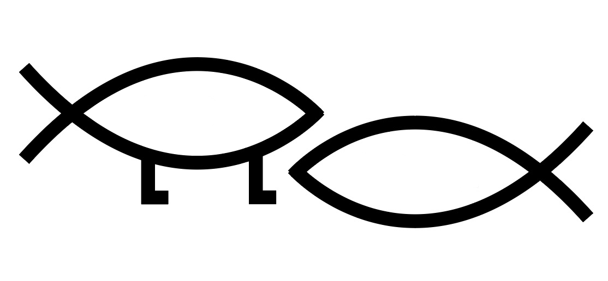

As a science educator for Christians, the majority of questions I receive are about two topics: climate change and evolution. I've written a guide to climate change intended for people of any background, and am in the process of writing several more guides to evolution, the Big Bang, vaccines, and Genesis. I’m also exploring a series of devotionals based on science.

 <h3>Climate Change: A Guide for the Perplexed</h3>

After receiving many questions about the topic, I wrote an introductory-level guide to climate change. It assumes no scientific background, and it’s ordered by topic so you can easily find what you’re looking for. If you don't believe in climate change, want to know more, or are just confused, this is for you.

|  |  |  |
| :------: | ----- | :----------: |
| 

 | |  |

| **Opinion Pieces** | | **The Coronavirus**  |
| :----------:         | --- | :-----:             |
| I wrote an Opinion piece in *The Tennesseean* arguing against the Trump administration’s attacks on clear air standards. [The Tennesseean, 2020](https://www.tennessean.com/story/opinion/2020/03/09/california-clean-car-standard-deserves-support/4980634002/)  | | I wrote a scientific primer on the coronavirus in the early days of the pandemic. [Part 1 - The Science](/PartOneScience)  |
|  ||  |
| I argue that all Christians should take part in the Global Climate Strike as a duty to both God and neighbor. [The Christian Post, 2019](https://www.christianpost.com/voice/were-young-evangelicals-and-were-striking-for-the-climate-will-you-join-us.html)    | | A deeper exploration and explanation of the public health solutions recommended by experts during the lockdowns. [Part 2 - The Solutions](/PartTwoSolutions)  |
|  ||  |
| I wrote a Letter to the Editor critiquing the Trump administration’s attacks on the Endangered Species Act and why Christians ought to care about protections for at-risk species. [The Tennesseean, 2019](assets/LTETennessean.pdf) | | Reflections on the spiritual and theological nature of pandemics, suffering, community, and reading scripture in trying times . [Part 3 - The Spirituality](/PartThreeSpirituality)  |
|  ||  |
| "Jesus didn’t say anything about climate change, but he said plenty about how we should care for those whom society would prefer to forget.” [Baptist News Global, 2017](https://baptistnews.com/article/climate-change-gospel-issue-time-christians-acknowledged/)  || I wrote a piece comparing the systemic natures of climate change and the pandemic: Climate, the Coronavirus, and Justice [Justice Unbound, 2020](https://justiceunbound.org/climate-the-coronavirus-and-justice/) |
|  ||  |
| When informed Christians ponder devastation from climate change that will affect millions of people for generations to come, it’s easy to lose hope for the future. But our actions still matter. We must not give up. [Baptist News Global, 2018](https://baptistnews.com/article/climate-nihilism-is-right-to-recognize-the-dire-situation-were-in-but-wrong-to-lose-hope/)  ||  |
|  ||  |

<!-- HTML !-->

/* CSS */
.button-4 {
  appearance: none;
  background-color: #3366ff;
  border: 1px solid rgba(27, 31, 35, 0.15);
  border-radius: 6px;
  box-shadow: rgba(27, 31, 35, 0.04) 0 1px 0, rgba(255, 255, 255, 0.25) 0 1px 0 inset;
  box-sizing: border-box;
  color: #24292E;
  cursor: pointer;
  display: inline-block;
  font-family: -apple-system, system-ui, "Segoe UI", Helvetica, Arial, sans-serif, "Apple Color Emoji", "Segoe UI Emoji";
  font-size: 14px;
  font-weight: 500;
  line-height: 20px;
  list-style: none;
  padding: 6px 16px;
  position: relative;
  transition: background-color 0.2s cubic-bezier(0.3, 0, 0.5, 1);
  user-select: none;
  -webkit-user-select: none;
  touch-action: manipulation;
  vertical-align: middle;
  white-space: nowrap;
  word-wrap: break-word;
}

.button-4:hover {
  background-color: #F3F4F6;
  text-decoration: none;
  transition-duration: 0.1s;
}

.button-4:disabled {
  background-color: #FAFBFC;
  border-color: rgba(27, 31, 35, 0.15);
  color: #959DA5;
  cursor: default;
}

.button-4:active {
  background-color: #EDEFF2;
  box-shadow: rgba(225, 228, 232, 0.2) 0 1px 0 inset;
  transition: none 0s;
}

.button-4:focus {
  outline: 1px transparent;
}

.button-4:before {
  display: none;
}

.button-4:-webkit-details-marker {
  display: none;
}
